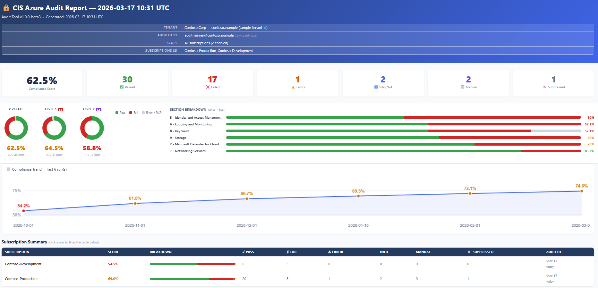

# CIS Microsoft Azure Foundations Benchmark v5.0.0 — Audit Tool

[](LICENSE)
[](https://www.cisecurity.org/benchmark/azure)
[](https://www.python.org/)
[](https://github.com/vegazbabz/CIS-Azure-Benchmark-Audit-Tool/actions/workflows/ci.yml)

> **[📊 View sample report](https://htmlpreview.github.io/?https://raw.githubusercontent.com/vegazbabz/CIS-Azure-Benchmark-Audit-Tool/main/docs/sample_report.html)** — synthetic data, no real tenant information.



**Version:** 1.1.0
**Benchmark:** [CIS Microsoft Azure Foundations Benchmark v5.0.0](https://www.cisecurity.org/benchmark/azure) (September 2025)
**Coverage:** 98 automated controls · 3 manual controls noted in output · 1 control pending (2.1.1)

---

## Overview

A Python tool that audits an Azure tenant against the **[CIS Microsoft Azure Foundations Benchmark v5.0.0](https://www.cisecurity.org/benchmark/azure)** — the industry-standard hardening guide for Azure environments, published by the [Center for Internet Security (CIS)](https://www.cisecurity.org/).

It requires no pip installs beyond the standard library — only Python 3.10+ and the Azure CLI.

Results are saved as checkpoints after each subscription completes, so a failed or interrupted run
can be resumed without re-running completed work. Output is a self-contained HTML report with
filtering, compliance scoring, charts, and per-finding remediation guidance. JSON and CSV exports
are generated alongside the HTML automatically.

---

## Requirements

### Runtime

| Requirement | Details |
| --- | --- |
| Python | [3.10 or higher](https://www.python.org/downloads/) |
| Azure CLI | Any recent version — <https://aka.ms/install-azure-cli> |
| resource-graph extension | Installed automatically on first run |
| Azure login | `az login` completed before running |
| msal | `pip install -r requirements.txt` — required for check 5.1.1 (optional, see below) |

### Azure permissions

| Scope | Role | Purpose |
| --- | --- | --- |
| Each subscription | Reader | Enumerate all resources |
| Each subscription | Security Reader | Defender plans, security contacts |
| Microsoft Entra ID (tenant) | Global Reader | Identity checks (5.x) |
| Key Vaults (optional) | Key Vault Reader | List keys, secrets, certificates for 8.3.x checks |

> **Key Vault data plane:** Controls 8.3.1–8.3.4, 8.3.9, and 8.3.11 enumerate individual keys,
> secrets, and certificates. This requires data plane access in addition to Reader.
> For RBAC-enabled vaults assign **Key Vault Reader**; for access-policy vaults, add the
> runner account to the vault's access policy. Without this, affected checks return ERROR with a
> clear explanation and remediation hint in the report — compliance is unknown, not assumed clean.

### Dependencies

The tool has one runtime dependency — `msal` — used only for check 5.1.1 (Security defaults).
Install it with:

```bash
pip install -r requirements.txt
```

If `msal` is not installed, check 5.1.1 will still run via the `az` CLI path, but will return
ERROR because the `az` CLI app cannot acquire `Policy.Read.All`. All other checks have no pip
dependencies.

Dev dependencies (`black`, `flake8`, `mypy`, and optionally `rich`) are listed in `requirements-dev.txt`:

```bash
pip install -r requirements-dev.txt
```

---

## Quick Start

```powershell
# 1. Login to Azure
az login

# 2. Run the audit (audits all enabled subscriptions)
python cis_azure_audit.py
```

The report opens automatically in your browser when the audit finishes. The script will also
automatically install the `resource-graph` extension if missing, enumerate all enabled
subscriptions, run all checks, and save the report files to a `reports/` subdirectory.

---

## Getting Started (step-by-step)

New to Python or the Azure CLI? Follow these steps to get the tool running on your machine.

### Step 1 — Install Python

1. Go to [https://www.python.org/downloads/](https://www.python.org/downloads/) and download the
   latest **Python 3.10+** installer for your OS.
2. Run the installer. On Windows, check **"Add Python to PATH"** before clicking Install.
3. Verify the installation:

   ```powershell
   python --version
   ```

### Step 2 — Install the Azure CLI

1. Follow the official instructions at <https://aka.ms/install-azure-cli> for your OS.
2. Verify:

   ```powershell
   az --version
   ```

### Step 3 — Get the tool

**Option A — Clone with Git** (recommended — makes updating easy):

```powershell
git clone https://github.com/vegazbabz/CIS-Azure-Benchmark-Audit-Tool.git
cd CIS-Azure-Benchmark-Audit-Tool
```

**Option B — Download as ZIP** (no Git required):

1. On the [GitHub repository page](https://github.com/vegazbabz/CIS-Azure-Benchmark-Audit-Tool),
   click the green **Code** button → **Download ZIP**.
2. Extract the ZIP and open a terminal in the extracted folder.

### Step 4 — Install the Python dependency

The only runtime dependency is `msal` (used for one optional check). Install it with:

```powershell
pip install -r requirements.txt
```

### Step 5 — Log in to Azure

```powershell
az login
```

A browser window will open for you to sign in. The account you use needs at minimum **Reader**
and **Security Reader** on the subscriptions you want to audit.

### Step 6 — Run the audit

```powershell
python cis_azure_audit.py
```

The tool will enumerate all your enabled subscriptions, run all checks, and open the HTML report
in your browser automatically when done. Reports are saved to a `reports/` subfolder.

> **Tip:** To audit a single subscription instead of the whole tenant, use the `-s` flag:
>
> ```powershell
> python cis_azure_audit.py -s "My Subscription Name"
> ```

---

## Project Structure

```text
cis_azure_audit.py          Main entry point and CLI
cis_audit.toml              Optional configuration file (parallel, timeouts, etc.)
requirements.txt            Runtime pip dependency (msal)
azure/
  client.py                 az CLI wrappers, retry logic, error classification helpers
  graph_auth.py             MSAL-based Graph auth for Policy.Read.All (check 5.1.1)
  helpers.py                Shared Azure utilities
  identity.py               Permission preflight and role helpers
checks/
  s2.py                     Section 2 — Databricks
  s5.py                     Section 5 — Identity
  s6.py                     Section 6 — Monitoring
  s7.py                     Section 7 — Networking
  s8.py                     Section 8 — Security Services
  s9.py                     Section 9 — Storage
cis/
  checkpoint.py             Checkpoint read/write, result reclassification on load
  check_helpers.py          Shared check utilities (port ranges, NSG rules, etc.)
  config.py                 Config file loader (cis_audit.toml)
  helpers.py                Logging setup, console output
  history.py                Run history for compliance trend tracking
  models.py                 Result dataclass (R)
  report.py                 HTML report generation, JSON/CSV export
  suppressions.py           Finding suppression (accepted risks)
scripts/
  preflight_check.py        Standalone permission check script
tests/                      Unit test suite (no Azure connection required)
```

---

## Configuration File

`cis_audit.toml` is loaded automatically from the same directory as `cis_azure_audit.py`.
All settings are optional — omit any line to keep the built-in default.
The path can be overridden with the `CIS_AUDIT_CONFIG` environment variable.

```toml
[audit]
parallel       = 3          # Concurrent subscription workers (1–20)
executor       = "thread"   # "thread" (recommended on Windows) or "process"
checkpoint_dir = "cis_checkpoints"

[timeouts]
default      = 20    # Most az CLI calls (seconds)
storage_list = 30    # az storage account list
storage_svc  = 15    # Per-account blob/file/table service queries
activity_log = 25    # Activity log queries
graph        = 120   # Resource Graph bulk queries

# Optional — enables automated evaluation of 5.1.1 (Security defaults).
# See "Check 5.1.1 setup" below for the one-time app registration steps.
[graph_auth]
# client_id     = "00000000-0000-0000-0000-000000000000"
# tenant_id     = ""  # optional — auto-detected via az account show
# client_secret = ""  # SP / CI only; omit for interactive user auth
```

> **Security note:** Never store a real `client_secret` value in `cis_audit.toml` — it could be
> accidentally committed to source control. Use the `CIS_GRAPH_CLIENT_SECRET` environment variable
> instead, or a secrets manager such as Azure Key Vault or GitHub Actions secrets.

CLI flags override `cis_audit.toml` values when both are set.

---

## Usage

```text
python cis_azure_audit.py [options]
```

### All options

| Option | Description |
| --- | --- |
| `-s`, `--subscription` | Audit one or more subscriptions by name or GUID. Multiple values follow a single flag: `-s Sub1 Sub2 Sub3` |
| `-o`, `--output` | Output HTML filename (default: `reports/cis_azure_audit_report_<timestamp>.html`) |
| `--output-dir` | Directory for all output files (HTML, JSON, CSV, checkpoints) |
| `-p`, `--parallel` | Concurrent subscription workers (default: from config or 3) |
| `--executor` | Worker backend: `thread` (default) or `process` |
| `--no-adaptive-concurrency` | Disable dynamic worker tuning when throttling is detected |
| `-l`, `--level` | Filter output to Level `1` or `2` controls only |
| `--fresh` | Clear all checkpoints and start a full re-audit |
| `--report-only` | Regenerate the HTML/JSON/CSV from existing checkpoints — no API calls |
| `--suppressions` | Path to suppressions TOML file (default: `suppressions.toml` next to the script) |
| `--list-suppressions` | Print all active suppressions and exit |
| `--no-open` | Do not auto-open the report in the browser after the audit completes |
| `--skip-preflight` | Skip permission preflight checks |
| `-q`, `--quiet` | Suppress per-check progress lines; only show summary |
| `--log-level` | Base log level: `TRACE`, `DEBUG`, `INFO`, `WARNING`, `ERROR`, `CRITICAL` |
| `-v`, `--verbose` | Verbose logging (sets `DEBUG`) |
| `--debug` | Trace logging (sets `TRACE`) |
| `--log-file` | Write full logs to a file in addition to the console |

### Examples

```powershell
# Audit all subscriptions
python cis_azure_audit.py

# Audit a single subscription by name
python cis_azure_audit.py -s "Production"

# Audit multiple subscriptions
python cis_azure_audit.py -s "Production" "Staging"

# Run faster with more parallel workers
python cis_azure_audit.py --parallel 5

# Use thread workers (recommended on Windows)
python cis_azure_audit.py --executor thread --parallel 4

# Save everything to a specific folder
python cis_azure_audit.py --output-dir C:\AuditResults

# Interrupted run? Just re-run — it resumes automatically
python cis_azure_audit.py

# Start completely fresh, ignoring previous checkpoints
python cis_azure_audit.py --fresh

# Regenerate the HTML report without re-running any checks
python cis_azure_audit.py --report-only

# Level 1 controls only
python cis_azure_audit.py --level 1

# Quiet mode — suppress per-check lines, show only summary
python cis_azure_audit.py --quiet

# Trace-level diagnostics written to a log file
python cis_azure_audit.py --debug --log-file cis_audit.log

# See what findings are currently suppressed
python cis_azure_audit.py --list-suppressions

# Regenerate the report after editing suppressions.toml (no re-audit needed)
python cis_azure_audit.py --report-only
```

### Concurrency tuning

The audit adapts worker count automatically when Azure API throttling (HTTP 429) is detected:

- Starts at `--parallel` workers (minimum 1).
- Reduces workers when transient throttling retries spike.
- Gradually restores workers after stable batches.

Use `--no-adaptive-concurrency` to keep the worker count fixed.

#### Benchmark your own defaults

```powershell
$py  = "python"
$sub = "<YOUR-LARGEST-SUBSCRIPTION-NAME>"
$runs = @(
  @{executor="thread";  parallel=2},
  @{executor="thread";  parallel=4},
  @{executor="process"; parallel=2}
)

foreach ($r in $runs) {
  $label = "$($r.executor)-p$($r.parallel)"
  $log   = "bench_$label.log"
  $elapsed = Measure-Command {
    & $py cis_azure_audit.py --subscription "$sub" --executor $r.executor --parallel $r.parallel `
      --level 1 --fresh --skip-preflight --output "bench_$label.html" --log-file $log *> $null
  }
  $retries = (Select-String -Path $log -Pattern "transient error" -SimpleMatch | Measure-Object).Count
  Write-Output "$label : $([Math]::Round($elapsed.TotalSeconds,2))s  retries=$retries"
}
```

Run each candidate 2–3 times and compare median runtime, not a single run.

---

## How It Works

### Data collection — three methods

#### 1. Azure Resource Graph (bulk prefetch — once per audit)

Before any per-subscription work begins, Kusto queries fetch all relevant resources across the
entire tenant in a single round trip:

- Network Security Groups and security rules
- Storage accounts and security properties
- Key Vaults — access configuration and network settings
- Virtual Networks, subnets, and NSG associations
- Application Gateways and WAF settings
- Databricks workspaces
- Bastion Hosts
- Network Watchers and resource locations
- Role assignments (Owner and User Access Administrator)
- WAF policies

#### 2. Azure CLI calls per subscription

For live service configurations and data Resource Graph cannot expose:

- `az security pricing show` — Defender plan statuses (8.1.x)
- `az security contact list` — notification settings (8.1.12–8.1.15)
- `az monitor diagnostic-settings list` — Key Vault and App Service logging
- `az monitor activity-log alert list` — all 11 alert checks (6.1.2.x)
- `az keyvault key/secret list` — expiry dates per key and secret
- `az keyvault key rotation-policy show` — auto rotation configuration
- `az keyvault certificate show` — certificate validity periods
- `az storage account blob-service-properties show` — soft delete, versioning
- `az storage account file-service-properties show` — file soft delete, SMB settings
- `az network watcher flow-log list` — flow log retention (7.5, 7.8)
- `az role definition list` — custom admin roles (5.23)

#### 3. Azure REST API via `az rest`

For tenant-level identity checks not available via the az CLI:

- `graph.microsoft.com/v1.0/policies/authorizationPolicy` — covers 5.4, 5.14, 5.15, 5.16
- ARM REST for WDATP integration settings (8.1.3.3) and attack path notifications (8.1.15)

### Permission preflight

Before the audit begins, the tool checks whether the runner account holds the required roles on
every subscription. On large tenants this runs in parallel (up to 8 subscriptions at once) so the
check completes in seconds rather than minutes.

### Checkpoints and resume

After each subscription completes, results are written to `cis_checkpoints/<subscription-id>.json`.
If the script is stopped or crashes mid-run, re-running it will skip completed subscriptions and
continue from where it left off. Use `--fresh` to discard all checkpoints and start over.

Pressing **Ctrl+C once** exits cleanly: in-flight Azure CLI subprocesses are killed immediately,
a message is printed telling you how to resume or start fresh, and the process exits without
leaving orphaned background processes or a frozen terminal.

### Parallel execution

Subscriptions run concurrently via Python's `concurrent.futures` executor. The default is 3 parallel
workers (configurable in `cis_audit.toml` or via `--parallel`). The Resource Graph prefetch always
runs once before the parallel loop begins.

---

## HTML Report

The generated report is a self-contained HTML file with no external dependencies.

- **Summary cards** — compliance score (PASS / total, excluding INFO and MANUAL), plus counts for each status.
- **Compliance donuts** — three ring charts showing PASS/FAIL/ERROR proportions overall, for Level 1, and for Level 2.
- **Section breakdown** — horizontal stacked bars per CIS section, sorted worst to best.
- **Per-subscription summary** — stacked-bar table showing pass/fail/error counts per subscription; click a row to filter the results table to that subscription.
- **Filterable table** — filter simultaneously by free-text search, subscription, status, and level (L1/L2). Section headers collapse when all their results are filtered out.
- **Per-resource results** — each NSG, storage account, Key Vault, subnet, and Databricks workspace is reported individually, not aggregated to a single pass/fail per control.
- **Remediation hints** — every FAIL result includes the Azure portal navigation path to fix the issue. ERROR results include an actionable explanation of what access is missing.
- **Export** — JSON and CSV files are generated alongside the HTML at report time. Click **Export JSON** or **Export CSV** in the report to download them.
- **Compliance trend** — after two or more full-tenant audit runs, a collapsible chart appears above the results table showing the compliance score over time. Collapsed by default so it does not distract from current findings. Not shown when running with `--subscription` filters, since a filtered run reflects a subset of the tenant and cannot be compared to a full-tenant baseline.
- **Back to top** — fixed button in the bottom-right corner for long reports.

### Status types

| Status | Meaning |
| --- | --- |
| PASS | Control is compliant |
| FAIL | Control is non-compliant — remediation hint provided |
| ERROR | Check could not complete — audit gap (permissions missing, timeout, or API error). Compliance is **unknown**; do not treat as clean. |
| INFO | Not applicable — the resource type doesn't exist or the account type doesn't support the feature (e.g. ADLS Gen2 has no blob/file service) |
| MANUAL | Cannot be automated — requires manual verification per the CIS PDF |
| SUPPRESSED | Accepted risk — defined in `suppressions.toml` with a justification and expiry |

> **ERROR vs INFO distinction:**
> `ERROR` means *"the control applies, but the audit couldn't evaluate it"* — flag it for follow-up.
> `INFO` means *"the control genuinely doesn't apply here"* — for example, an ADLS Gen2 storage account
> has no blob/file service by design, so the blob checks simply don't apply. There is nothing to fix.

### `--report-only`: regenerate the report without re-auditing

```powershell
python cis_azure_audit.py --report-only
```

Loads all existing checkpoints and regenerates the HTML, JSON, and CSV — no Azure API calls are made.
Useful after:

- Editing `suppressions.toml` to accept a finding
- Upgrading the tool (the new error classification and message formatting is applied on load)
- Changing the `--level` filter

Section 5 tenant-level identity checks (5.1.1, 5.1.2, 5.1.3, 5.4, 5.14, 5.15, 5.16) are
**re-run** at report time because they are not stored in subscription checkpoints. Live Graph API
results (5.4, 5.14, 5.15, 5.16) will reflect the current state of your tenant. MANUAL findings
(5.1.3) will always appear. If Graph is unreachable, those checks are skipped with a warning and
the report is still generated from checkpoints.

Results loaded from checkpoints are automatically reclassified using the current tool logic:
`FeatureNotSupportedForAccount` storage errors recorded as ERROR in older checkpoints are shown
as INFO, Key Vault permission errors are rewritten with clean actionable messages, and any section
name corrections introduced in newer versions of the tool are applied on load.

### Output files

Each run produces three report files and updates the run history:

| File | Contents |
| --- | --- |
| `reports/cis_azure_audit_report_<timestamp>.html` | Self-contained interactive report (auto-opens in browser) |
| `reports/cis_azure_audit_report_<timestamp>.json` | All results as a JSON array |
| `reports/cis_azure_audit_report_<timestamp>.csv` | All results as a flat CSV |
| `reports/cis_run_history.json` | Compliance score history for the trend chart (last 30 full-tenant runs) |

Use `--output` to set a custom filename, or `--output-dir` to redirect all output to a different directory.
The history file is always written to the same directory as the HTML report.

> **History note:** `cis_run_history.json` is only updated on full-tenant runs (no `--subscription` filter).
> Per-subscription runs do not contribute to the trend chart so the baseline stays consistent.
>
> **Note:** `--report-only` does **not** update the history file — it regenerates the report from
> existing checkpoints but is not a new measurement.

---

## Suppressing Findings (Accepted Risks)

Some findings are intentional — for example, a jump host that deliberately has RDP open, or a
DDoS plan that is not required for a given environment. Without a way to acknowledge these,
every report contains the same known findings and reviewers stop trusting the output.

A `suppressions.toml` file next to `cis_azure_audit.py` lets you mark specific findings as
accepted risks. Suppressed findings still appear in the report in grey with your justification
visible — they are never hidden. The compliance score excludes them (like INFO and MANUAL).

Suppressions are applied at **report generation time only**. Checkpoints always store the raw
FAIL, so removing a suppression and running `--report-only` immediately reinstates the finding.

### suppressions.toml format

```toml
[[suppressions]]
control_id    = "7.1"
resource      = "jumphost-nsg"   # optional — exact match; omit to match all resources
subscription  = "Production"     # optional — exact match; omit to match all subscriptions
justification = "Intentional RDP jump host — restricted by Azure Firewall IP allowlist"
expires       = "2026-12-31"     # required — ISO date, maximum 1 year from today

[[suppressions]]
control_id    = "8.5"
justification = "DDoS protection not required — no public-facing workloads in this tenant"
expires       = "2026-06-01"
```

### Suppression rules

| Field | Required | Behaviour |
| --- | --- | --- |
| `control_id` | Yes | Exact match against the CIS control number |
| `resource` | No | Exact case-insensitive match against the resource name; omit to match all |
| `subscription` | No | Exact case-insensitive match against the subscription name; omit to match all |
| `justification` | Yes | Free text — shown in the report next to the finding |
| `expires` | Yes | ISO date (`YYYY-MM-DD`); maximum 1 year from today |

- Only `FAIL` and `ERROR` findings can be suppressed
- Expired entries are skipped and the finding reverts to `FAIL`/`ERROR` with a warning logged
- Entries with expiry beyond 1 year are capped at 1 year with a warning

### Suppression workflow

```powershell
# 1. Check what is currently suppressed
python cis_azure_audit.py --list-suppressions

# 2. Edit suppressions.toml, then regenerate the report without re-auditing
python cis_azure_audit.py --report-only

# 3. Use a custom suppressions file (e.g. per-environment)
python cis_azure_audit.py --suppressions prod-suppressions.toml
```

---

## Controls Covered

### Section 2 — Azure Databricks (5 of 6 automated)

| Control | Title | Level |
| --- | --- | --- |
| 2.1.2 | NSGs configured for Databricks subnets | L1 |
| 2.1.7 | Diagnostic logging configured | L1 |
| 2.1.9 | No Public IP enabled | L1 |
| 2.1.10 | Public network access disabled | L1 |
| 2.1.11 | Private endpoints used to access workspaces | L2 |

> **2.1.1** (Databricks in customer-managed VNet) — pending implementation.

### Section 3 — Compute Services (1 manual)

| Control | Title | Level | Notes |
| --- | --- | --- | --- |
| 3.1.1 | Only MFA-enabled identities can access privileged VMs | L2 | **Manual** — requires correlating role assignments with MFA status |

> **Sections 3 and 4** of the CIS Azure Foundations Benchmark v5.0.0 are largely reference
> sections — most Compute and Database controls have been relocated to the
> *CIS Microsoft Azure Compute Services Benchmark* and *CIS Microsoft Azure Database
> Services Benchmark* respectively. Only 3.1.1 (Virtual Machines) remains in the
> Foundations Benchmark as an auditable control.

### Section 5 — Identity Services (9 automated · 2 manual)

| Control | Title | Level | Notes |
| --- | --- | --- | --- |
| 5.1.1 | Security defaults enabled | L1 | Requires `[graph_auth]` setup — see below |
| 5.1.2 | MFA enabled for all users | L1 | |
| 5.1.3 | Allow users to remember MFA on trusted devices disabled | L1 | **Manual** — no API available |
| 5.3.3 | User Access Administrator role restricted | L1 | |
| 5.4 | Restrict non-admin users from creating tenants | L1 | |
| 5.14 | Users cannot register applications | L1 | |
| 5.15 | Guest access restricted to own directory objects | L1 | |
| 5.16 | Guest invite restrictions set to admins or no one | L2 | |
| 5.23 | No custom subscription administrator roles | L1 | |
| 5.27 | Between 2 and 3 subscription owners | L1 | |
| 5.28 | Privileged users protected by phishing-resistant MFA | L1 | **Manual** — Entra ID portal review |

> **5.1.1** — The `az` CLI app cannot acquire `Policy.Read.All`. Without `[graph_auth]`
> configured, this check returns ERROR with instructions to set it up. With `[graph_auth]`
> configured, MSAL is used (browser popup once for user accounts; client credentials for SPs).
> Returns INFO when security defaults are disabled but Conditional Access policies are present
> (CA is the stronger control and disabling security defaults is intentional in that case).
>
> **5.1.2** — Uses the Graph beta authentication methods registration report
> (`/beta/reports/authenticationMethods/userRegistrationDetails`). Any user without
> `isMfaRegistered = true` is reported as non-compliant.
>
> **5.1.3** — Manual. The "Allow users to remember MFA on trusted devices" setting lives in the
> deprecated Per-user MFA portal, which has no stable Graph API surface.

#### Check 5.1.1 setup (one-time)

1. In Entra ID, go to **App registrations** → **New registration** (any name, single-tenant).
2. **API permissions** → Add → Microsoft Graph → **Delegated** → `Policy.Read.All` → **Grant admin consent**.
3. For service principal / CI: also add the **Application** permission `Policy.Read.All` and consent it; set the secret via the `CIS_GRAPH_CLIENT_SECRET` **environment variable** (recommended — avoids storing credentials in `cis_audit.toml`), or set `client_secret` in `[graph_auth]` for local use only.
4. Copy the **Application (client) ID** into `cis_audit.toml`:

   ```toml
   [graph_auth]
   client_id = "your-app-client-id"
   ```

5. `pip install -r requirements.txt`
6. Run the tool — a browser window opens once for interactive sign-in; subsequent runs use a token
   cached at `~/.cis_audit/msal_token_cache.json`.

> **Device code flow is not used.** MSAL is configured to use the authorization code flow with
> PKCE (interactive browser) in user mode, in line with CIS 5.2.3.

### Section 6 — Logging and Monitoring (17 automated)

| Control | Title | Level |
| --- | --- | --- |
| 6.1.1.1 | Diagnostic Setting exists for Subscription Activity Logs | L1 |
| 6.1.1.2 | Diagnostic Setting captures required categories | L1 |
| 6.1.1.3 | Activity log retention >= 365 days | L1 |
| 6.1.1.4 | Key Vault diagnostic logging enabled | L1 |
| 6.1.1.6 | Azure AppService HTTP logs enabled | L2 |
| 6.1.2.1 | Activity Log Alert: Create Policy Assignment | L1 |
| 6.1.2.2 | Activity Log Alert: Delete Policy Assignment | L1 |
| 6.1.2.3 | Activity Log Alert: Create or Update NSG | L1 |
| 6.1.2.4 | Activity Log Alert: Delete NSG | L1 |
| 6.1.2.5 | Activity Log Alert: Create or Update Security Solution | L1 |
| 6.1.2.6 | Activity Log Alert: Delete Security Solution | L1 |
| 6.1.2.7 | Activity Log Alert: Create or Update SQL Firewall Rule | L1 |
| 6.1.2.8 | Activity Log Alert: Delete SQL Firewall Rule | L1 |
| 6.1.2.9 | Activity Log Alert: Create or Update Public IP | L1 |
| 6.1.2.10 | Activity Log Alert: Delete Public IP | L1 |
| 6.1.2.11 | Activity Log Alert: Service Health | L1 |
| 6.1.3.1 | Application Insights configured | L2 |

### Section 7 — Networking Services (13 automated)

| Control | Title | Level |
| --- | --- | --- |
| 7.1 | RDP (3389) not open to internet | L1 |
| 7.2 | SSH (22) not open to internet | L1 |
| 7.3 | UDP access from internet restricted | L1 |
| 7.4 | HTTP/HTTPS (80/443) from internet evaluated and restricted | L1 |
| 7.5 | NSG flow log retention >= 90 days | L2 |
| 7.6 | Network Watcher enabled for all regions in use | L2 |
| 7.8 | VNet flow log retention >= 90 days | L2 |
| 7.10 | WAF enabled on Azure Application Gateway | L2 |
| 7.11 | Subnets associated with NSGs | L1 |
| 7.12 | App Gateway SSL policy min TLS 1.2+ | L1 |
| 7.13 | HTTP2 enabled on Application Gateway | L1 |
| 7.14 | WAF request body inspection enabled | L2 |
| 7.15 | WAF bot protection enabled | L2 |

### Section 8 — Security Services (30 automated)

| Control | Title | Level |
| --- | --- | --- |
| 8.1.1.1 | Microsoft Defender CSPM | L2 |
| 8.1.2.1 | Microsoft Defender for APIs | L2 |
| 8.1.3.1 | Microsoft Defender for Servers | L2 |
| 8.1.3.3 | Endpoint protection (WDATP) component | L2 |
| 8.1.4.1 | Microsoft Defender for Containers | L2 |
| 8.1.5.1 | Microsoft Defender for Storage | L2 |
| 8.1.6.1 | Microsoft Defender for App Services | L2 |
| 8.1.7.1 | Microsoft Defender for Azure Cosmos DB | L2 |
| 8.1.7.2 | Microsoft Defender for Open-Source Relational DBs | L2 |
| 8.1.7.3 | Microsoft Defender for SQL (Managed Instance) | L2 |
| 8.1.7.4 | Microsoft Defender for SQL Servers on Machines | L2 |
| 8.1.8.1 | Microsoft Defender for Key Vault | L2 |
| 8.1.9.1 | Microsoft Defender for Resource Manager | L2 |
| 8.1.10 | Defender configured to check VM OS updates | L1 |
| 8.1.12 | Security alerts notify subscription Owners | L1 |
| 8.1.13 | Additional email addresses for security contact | L1 |
| 8.1.14 | Alert severity notifications configured | L1 |
| 8.1.15 | Attack path notifications configured | L1 |
| 8.3.1 | Key expiration set — RBAC Key Vaults | L1 |
| 8.3.2 | Key expiration set — non-RBAC Key Vaults | L1 |
| 8.3.3 | Secret expiration set — RBAC Key Vaults | L1 |
| 8.3.4 | Secret expiration set — non-RBAC Key Vaults | L1 |
| 8.3.5 | Key Vault purge protection enabled | L1 |
| 8.3.6 | Key Vault RBAC authorization enabled | L2 |
| 8.3.7 | Key Vault public network access disabled | L1 |
| 8.3.8 | Private endpoints used to access Key Vault | L2 |
| 8.3.9 | Automatic key rotation enabled | L2 |
| 8.3.11 | Certificate validity period <= 12 months | L1 |
| 8.4.1 | Azure Bastion Host exists | L2 |
| 8.5 | DDoS Network Protection enabled on VNets | L2 |

> **Key Vault data-plane checks (8.3.1–8.3.4, 8.3.9, 8.3.11):** these require data-plane access
> beyond subscription Reader. If the runner cannot reach the vault (firewall, private endpoint) or
> lacks a Key Vault data-plane role / access policy, the check returns ERROR with an actionable message
> explaining exactly what is missing — compliance is unknown, not assumed clean.

### Section 9 — Storage Services (24 automated)

| Control | Title | Level |
| --- | --- | --- |
| 9.1.1 | Azure Files soft delete enabled | L1 |
| 9.1.2 | SMB protocol version >= 3.1.1 | L1 |
| 9.1.3 | SMB channel encryption AES-256-GCM or higher | L1 |
| 9.2.1 | Blob soft delete enabled | L1 |
| 9.2.2 | Container soft delete enabled | L1 |
| 9.2.3 | Blob versioning enabled | L2 |
| 9.2.4 | Storage logging enabled for Blob Service read requests | L2 |
| 9.2.5 | Storage logging enabled for Blob Service write requests | L2 |
| 9.2.6 | Storage logging enabled for Blob Service delete requests | L2 |
| 9.3.1.1 | Key rotation reminders enabled | L1 |
| 9.3.1.2 | Access keys regenerated within 90 days | L1 |
| 9.3.1.3 | Storage account key access disabled | L1 |
| 9.3.2.1 | Private endpoints used to access storage accounts | L2 |
| 9.3.2.2 | Public network access disabled | L1 |
| 9.3.2.3 | Default network access rule is Deny | L1 |
| 9.3.3.1 | Default to Microsoft Entra authorization in Azure portal | L1 |
| 9.3.4 | Secure transfer (HTTPS) required | L1 |
| 9.3.5 | Allow Azure trusted services to access storage | L2 |
| 9.3.6 | Minimum TLS version 1.2 | L1 |
| 9.3.7 | Cross-tenant replication disabled | L1 |
| 9.3.8 | Blob anonymous access disabled | L1 |
| 9.3.9 | Storage account has CanNotDelete resource lock | L1 |
| 9.3.10 | Storage account has ReadOnly resource lock | L2 |
| 9.3.11 | Redundancy set to geo-redundant (GRS) | L2 |

> **ADLS Gen2 / Data Lake storage accounts** do not have a blob or file service — the 9.1.x and
> 9.2.x checks return INFO for these account types (not ERROR), because the controls genuinely
> do not apply.

---

## Testing

The test suite uses Python's built-in `unittest` — no extra packages required.
All tests mock Azure CLI calls so no real Azure connection is needed.

### Run everything

```powershell
python -m unittest discover -s tests -p "test_*.py" -v
```

### Run one test file

```powershell
python -m unittest tests.test_checks -v
python -m unittest tests.test_report -v
```

### Run one test class

```powershell
python -m unittest tests.test_permissions.TestPreflight -v
```

### Continuous Integration

A GitHub Actions pipeline runs on every push and pull request:

- `python -m unittest` (Python 3.10, 3.11, 3.12, 3.13)
- `black --check` formatting
- `flake8` linting
- `mypy` static type checks

The workflow file lives at `.github/workflows/ci.yml`.

#### Using this tool in your own CI/CD pipeline

Add `--exit-code` to make the tool exit with code 2 when any FAIL or ERROR results are found.
This lets Azure DevOps, GitHub Actions, and similar systems fail the build on compliance regressions:

```yaml
# GitHub Actions example
- name: Azure foundations audit
  run: |
    python cis_azure_audit.py \
      --subscription "Production" \
      --no-open \
      --exit-code
  # Step fails (exit code 2) if any controls are non-compliant
```

```yaml
# Azure DevOps example
- script: |
    python cis_azure_audit.py --subscription $(SUB_NAME) --no-open --exit-code
  displayName: 'Azure Foundations audit'
  # Marks the pipeline stage as failed when FAIL/ERROR results are found
```

Exit code summary:

| Code | Meaning |
| --- | --- |
| `0` | Audit completed — all controls passed (or all failures are suppressed) |
| `1` | Tool setup error — az CLI missing, not logged in, or authentication failed |
| `2` | Compliance failure — one or more FAIL or ERROR results detected (only with `--exit-code`) |

---

## Checkpoint Files

```text
cis_checkpoints/
  |- xxxxxxxx-xxxx-xxxx-xxxx-xxxxxxxxxxxx.json   <- completed
  |- yyyyyyyy-yyyy-yyyy-yyyy-yyyyyyyyyyyy.json   <- completed
  `- zzzzzzzz-zzzz-zzzz-zzzz-zzzzzzzzzzzz.json  <- failed (retried on next run)
```

Each file contains the full result set for that subscription, a UTC timestamp, and a completion
status. Delete the `cis_checkpoints/` folder or use `--fresh` to discard all checkpoints.
Use `--report-only` to regenerate the HTML report from existing checkpoints without running any checks.

When checkpoints are loaded, results are automatically reclassified using the current tool logic.
This means upgrading the tool and running `--report-only` will apply corrected error classifications,
message improvements, and control-metadata fixes from the new version to your existing checkpoint
data — in most cases no re-audit is required.

---

## Known Limitations

**Read-only** — the script audits only. It makes no changes to your environment.

**Point-in-time** — results reflect the state at the moment the script ran.

**Key Vault data plane access** — listing keys, secrets, and certificates requires data plane
permissions in addition to subscription Reader. Assign **Key Vault Reader** (RBAC vaults) or add
the runner account to the vault's access policy (non-RBAC vaults). Without this, affected checks
return ERROR with an explanatory message. The report clearly distinguishes this from a clean
result — compliance is unknown, not assumed clean.

**Check 5.1.1 returns ERROR (Policy.Read.All)**
The `az` CLI app cannot acquire `Policy.Read.All`. This is a Microsoft-imposed limitation — the
az CLI app (`04b07795-...`) is not pre-authorized for that scope. Configure `[graph_auth]` in
`cis_audit.toml` with your own app registration to resolve it (see "Check 5.1.1 setup" above).

**Graph API for identity checks** — controls 5.4, 5.14, 5.15, and 5.16 call the Graph API via
`az rest`. If the required Graph permissions have not been consented for the Azure CLI app, these
will return ERROR. Test with:

```powershell
az rest --method get --url "https://graph.microsoft.com/v1.0/policies/authorizationPolicy"
```

**Conditional Access policies (5.2.x)** — marked Manual in the benchmark and not checked by this
tool. They require review in the Entra ID portal.

**Large tenants** — Resource Graph handles bulk data efficiently, and the permission preflight
runs subscriptions in parallel. The main bottleneck at scale is per-subscription CLI calls.
Use `--parallel 5` or higher, or tune via `cis_audit.toml`.

---

## Troubleshooting

**`az` not found on Windows**
The script automatically uses `az.cmd` on Windows. Ensure the Azure CLI is installed and on your
PATH, then restart your terminal.

**Identity checks return ERROR (AccessDenied)**
Your account needs Global Reader in Entra ID. Test the Graph call directly:

```powershell
az rest --method get --url "https://graph.microsoft.com/v1.0/policies/authorizationPolicy"
```

If this fails, ask your Entra ID admin to grant Global Reader or consent to the required Graph API
permissions for the Azure CLI app (app ID: `04b07795-8ddb-461a-bbee-02f9e1bf7b46`).

**5.1.1 returns ERROR specifically (Policy.Read.All)**
This is expected without `[graph_auth]` configured. The az CLI app cannot acquire this scope.
See "Check 5.1.1 setup" under the Section 5 controls table.

**Key Vault checks return ERROR (audit incomplete)**
The runner account needs Key Vault data plane access. For RBAC-enabled vaults assign the
**Key Vault Reader** role; for access-policy vaults, add the account to the vault's access policy.
The ERROR message in the report states exactly what is missing.

**A check consistently times out**
All `az` CLI calls have configurable timeouts (default 20 seconds). Increase them in `cis_audit.toml`:

```toml
[timeouts]
default = 40
```

Timed-out checks are recorded as ERROR and the audit continues.

**Subscription not found**
Subscription names are matched exactly (case-sensitive). Run `az account list --output table` to
see the exact names available to your account.

**Interrupted run**
Press Ctrl+C once. In-flight Azure CLI calls are killed immediately, checkpoints for completed
subscriptions are preserved, and the process exits cleanly. Re-run the same command to resume
from where it stopped, or add `--fresh` to start over.

---

## Disclaimer

This tool is provided **as-is, with no warranty of any kind**. The maintainers and contributors
offer no SLA, make no guarantee of accuracy or completeness, and accept no legal responsibility
or liability for the use of this tool or any decisions made based on its output. Use is entirely
at your own risk. See [LICENSE](LICENSE) for the full MIT disclaimer.

## Attribution

This is an independent community implementation referencing the publicly available
**[CIS Microsoft Azure Foundations Benchmark v5.0.0](https://www.cisecurity.org/benchmark/azure)**.
CIS Benchmarks are the property of the Center for Internet Security (<https://www.cisecurity.org>),
used under [CC BY-NC-SA 4.0](https://creativecommons.org/licenses/by-nc-sa/4.0/).
This tool is not affiliated with, endorsed by, or approved by CIS.

**Version:** 1.1.0
**Benchmark:** CIS Microsoft Azure Foundations Benchmark v5.0.0 (September 2025)
**Coverage:** 98 automated controls · 3 manual controls noted in output · 1 control pending (2.1.1)
